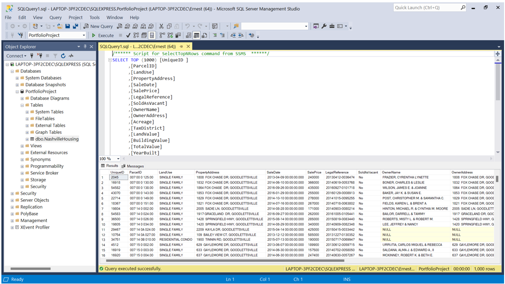

# HousingDataClean
## Nashville Housing: SQL Data Cleaning 
Nashville Housing company needs their data cleaned and organized, to have clearer data on their customers they have sold homes to. So they can expand on company services. 

Software used: 

<li>Microsoft Excel: Dataset file to import into SQL Server. 
<li>Microsoft SQL Server: To clean the data. 

Standardize Date Format

   
 The date was with the time, so I removed the time part and just keep the date.
 
Populate Property Address data
  

 
There was two parcel ids, two property addresses and one unique id. The null property address will combine with a newly created column of the property addresses that don’t contain more than one of each. Next to join to the original property address and this will create an updated version of property address with only one unique id each.

Breaking out Address into Individual Columns (Address, City, State)

Break property addresses 
  

  
I used the substring and len methods to break up the property address.
  
Break the owner address.
  

  
I used the parsename and replace methods. 

